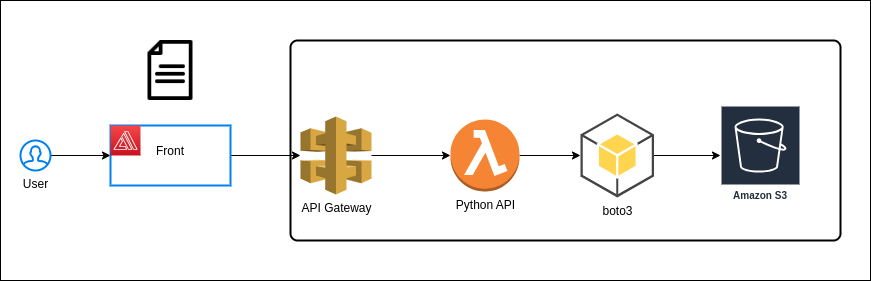

# nuclea-ada-aws-project
Projeto do modulo de AWS da ADA + Nuclea

## Equipe:
- André Bezerra
- Carlos Euardo
- Hugo Fernandes
- Matheus Fernandes

## Problemática: 

O gerente da empresa que você trabalha precisa subir relatórios, ele te chamou para ajudá-lo com uma nova automação que possa incluir esses arquivos garantindo resiliência, segurança e alta disponibilidade. Você como arquiteto/a de soluções o convence a usar AWS. O objetivo é mostrar a solução funcionando na reunião do final de módulo e apresentar ao gerente (vulgo seu instrutor) para alcançar sua promoção.

Obs: os relatórios podem ser fictícios - podendo usar qualquer tipo de arquivo Plus: Incluir o desenho da arquitetura planejada utilizando draw.io

## Diagrama:

  

## Resolução:

Foi desenvolvido um frontend para interagir com a aplicação, onde no front chama a API Gateway, que faz a chamada uma função lambda aonde está a nossa API Python, e la existem as rotas de listagem, envio e upload para o S3 com o auxilio da biblioteca boto3.

Link repositorio frontend: [Github](https://github.com/caducoder/aws-s3-lock)
